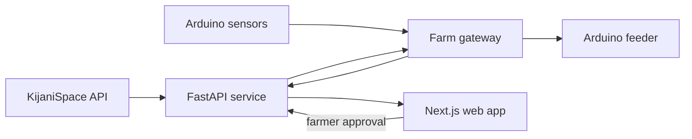

# Feed Sync

**Practical feeding decisions for cage and pond fish farms, informed by local conditions and field
devices.**

Feed Sync is a KijaniSpace Hackathon project that combines location-based agro-climate context with
farm observations, feeding records, and Arduino devices. Its goal is to make feeding decisions more
traceable, reduce avoidable waste, and improve day-to-day visibility across ponds and cages.

> [!NOTE]
> This repository is a verified bootstrap, not a production recommendation system. It contains the
> application foundations, API integration boundary, culture-system contracts, firmware examples,
> and an MVP plan.

## Included

- Next.js 16 App Router UI using Next's default Turbopack pipeline;
- FastAPI service managed with `uv`;
- tested, server-side KijaniSpace agro-climate client;
- discriminated pond and cage production-unit models;
- Arduino water-monitor and bounded feeder-controller sketches;
- architecture, integration, firmware, culture-system, and product documentation.

## System shape



KijaniSpace supplies regional, location-based context. Pond- or cage-level sensors supply local
measurements. Feed Sync keeps a person in the decision loop and treats device actuation as a
separate, bounded workflow.

## Repository layout

```text
FeedSync/
├── apps/
│   ├── api/                 # FastAPI, domain models, and KijaniSpace integration
│   └── web/                 # Next.js App Router web application
├── firmware/
│   ├── feeder_controller/   # Fail-closed serial-controlled servo example
│   └── water_monitor/       # Temperature and raw analog sensor example
└── docs/                    # Architecture, integration, and product guidance
```

## Quick start

### Requirements

- Node.js 22 or newer
- pnpm 10.7 or newer
- Python 3.12 or newer
- [uv](https://docs.astral.sh/uv/) 0.8 or newer
- KijaniSpace HTTP Basic credentials for live calls

### Install and run

```bash
corepack enable
pnpm install
uv sync --project apps/api
cp .env.example .env
pnpm dev
```

Add your server-side credentials to `.env`:

```dotenv
KIJANISPACE_USERNAME=your-username
KIJANISPACE_PASSWORD=your-password
```

The web app runs at `http://localhost:3000`; FastAPI runs at `http://localhost:3001`, with interactive
API docs at `http://localhost:3001/docs`.

```bash
curl http://localhost:3001/health
curl "http://localhost:3001/v1/context/water?lat=-1.0&lon=33.0"
```

Coordinates must be inside both the KijaniSpace-documented Lake Victoria coverage bounds and a
recognized water body. `-1.0, 33.0` is a tested open-water development coordinate. Keep the API
username and password server-side; never expose them through a `NEXT_PUBLIC_*` variable.

## Commands

| Command             | Purpose                                                |
| ------------------- | ------------------------------------------------------ |
| `pnpm dev`          | Run Next.js and FastAPI together                       |
| `pnpm dev:web`      | Run only the Next.js app                               |
| `pnpm dev:api`      | Run only FastAPI                                       |
| `pnpm build`        | Create the production Next.js build                    |
| `pnpm lint`         | Run ESLint and Ruff checks                             |
| `pnpm typecheck`    | Run TypeScript and Python static checks                |
| `pnpm test`         | Run web type checks and API tests                      |
| `pnpm format:check` | Check JavaScript, documentation, and Python formatting |

## Recommended hackathon slice

Demo one farm with two production units: one pond and one cage. For each, register geometry and
stocking, fetch KijaniSpace context, add one local temperature observation, produce a transparent
draft feed plan, record a farmer adjustment, and log the actual feeding. Demonstrate feeder
actuation only after the decision workflow is clear.

## Documentation

- [Architecture and boundaries](docs/architecture.md)
- [Pond and cage alignment](docs/culture-systems.md)
- [KijaniSpace API integration](docs/api-integration.md)
- [UI-oriented API endpoints and datasource mapping](docs/api-contract.md)
- [Feature recommendations and MVP](docs/features.md)
- [Firmware wiring, protocol, and safety](docs/firmware.md)
- [UI components, typography, assets, and routes](docs/ui-system.md)
- [Monorepo architecture decision](docs/adr/0001-monorepo.md)

## Safety and responsible use

Feed amounts depend on species, life stage, biomass, feed characteristics, water conditions, health,
and local practice. Every recommendation should expose its inputs, freshness, rationale, and missing
data, and should be reviewed with aquaculture expertise.

Do not treat a missing forecast, disconnected sensor, or uncalibrated probe as a zero reading. The
example feeder limits duration and fails closed, but it is not a certified production controller.
Use mechanical guards, suitable power protection, a physical stop, and supervised dry runs.

## Contributing

Keep changes inside the relevant app, firmware, or documentation boundary. Before opening a pull
request, run:

```bash
pnpm format:check
pnpm lint
pnpm typecheck
pnpm test
pnpm build
```

Document environment variables in `.env.example`. Never commit keys, tokens, personal information,
or raw farm exports. Licensing and governance remain decisions for the project team.
