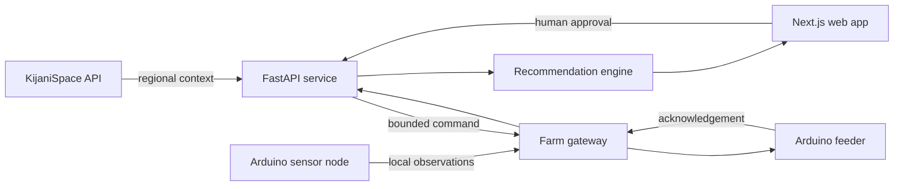

# Architecture

## Goals

Feed Sync combines remote context, production-unit observations, and farmer knowledge without
allowing any single data source to operate a feeder autonomously. The bootstrap favors a small
hackathon team while preserving boundaries that matter for field safety and future development.

The gateway is planned. A laptop or small Linux computer can bridge Arduino serial messages to the
API during the demo.

## Repository boundaries

- `apps/web` presents farm context and approval workflows. It never receives upstream secrets.
- `apps/api` owns validation, orchestration, domain contracts, and vendor calls.
- `apps/api/app/integrations` isolates the loosely typed KijaniSpace interface.
- `apps/api/app/domain` represents ponds and cages through a shared `CultureUnit` abstraction.
- `firmware` contains independently deployable Arduino sketches.

## Data principles

1. Identify observations and feed events by `culture_unit_id`, not a pond-specific identifier.
2. Preserve raw observations with source and time; derive recommendations separately.
3. Normalize vendor payloads before domain logic. KijaniSpace climate responses currently have no
   response schema in OpenAPI, so they stay untyped at the integration boundary.
4. Put units in field names or beside values; never rely on implicit measurement units.
5. Use UTC in transport and retain the farm's IANA timezone for display and scheduling.
6. Make commands idempotent and record acknowledgements before remote actuation.

## Toolchain

The web app uses Next.js App Router with Turbopack, Next's supported default bundler. The API uses
FastAPI, Pydantic, HTTPX, pytest, Ruff, and Pyright, with dependencies locked by `uv`. The JavaScript
and Python applications remain independently deployable even though root scripts operate them
together.

## Deployment direction

For the hackathon, deploy Next.js and FastAPI as two services. Add a relational database when the
first vertical slice needs persistence. A queue is unnecessary until offline device delivery and
retry semantics are implemented.
